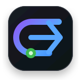

<div align="center">



# EvoTrace

### Turn real-world Claude Code and Codex sessions into reusable training, evaluation, and verification assets.

**A local-first trajectory compiler built on DeepSeek Harness.**

[Get started](#get-started) · [What you get](#what-you-get) · [Workflow](#the-core-workflow) · [Architecture](#built-on-deepseek-harness) · [中文](README.zh-CN.md)

[](https://github.com/jinzijian/EvoTrace/actions/workflows/ci.yml)
[](https://github.com/deepseek-ai/deepseek-harness)
[](LICENSE)

</div>

EvoTrace imports the coding-agent work already stored on your machine, finds the sessions worth keeping, and
compiles them into evidence-backed preference data, replayable coding tasks, RL environments, and execution-reward
candidates. You keep the source data and the resulting assets under your control.

It is **not another coding agent** and does not require you to change how you use Claude Code or Codex.

> [!WARNING]
> EvoTrace is early alpha, and DeepSeek Harness is a developer preview. Generated tasks and verifiers remain
> candidates until they pass the documented evidence and Docker validation gates.

## Get started

### 1. Install

macOS, Linux, or WSL:

```bash
curl -LsSf https://raw.githubusercontent.com/jinzijian/EvoTrace/main/install.sh | sh
```

Windows PowerShell:

```powershell
irm https://raw.githubusercontent.com/jinzijian/EvoTrace/main/install.ps1 | iex
```

### 2. Launch

```bash
evotrace
```

EvoTrace opens the DeepSeek Harness Web app. In **Settings**, choose any provider supported by your Harness setup,
such as DeepSeek, OpenAI, or Anthropic. Local import and deterministic mining do not require a model; agent review,
hardening, calibration, and evolution do.

New sessions start with Harness **Full access** by default. To use the narrower workspace sandbox:

```bash
DSH_PERMISSION_MODE=workspace-write evotrace
```

Docker is required only when you build or validate executable environments.

### 3. Build your first asset

Type `/` in the app and run:

```text
/init              import existing Claude Code and Codex history
/candidates        show the strongest evidence-backed sessions
/show 1            inspect candidate 1 and its missing evidence
/review 1          run the sequential four-agent review
/assets            inspect anything that was compiled or verified
```

That is the main product loop. A review may build an asset, route the session to preference data, keep it only as a
hardening seed, or reject it with explicit reasons. Rejection is a useful result: it prevents a long but weak
trajectory from being mislabeled as training-ready.

<p align="center">
  
</p>

## What you get

| Output | Recovered or generated from your sessions | Useful for |
|---|---|---|
| **Candidate catalog** | task intent, repo, corrections, failures, effective actions, provenance gaps | finding the small fraction of history worth keeping |
| **Preference and recovery data** | rejected/chosen attempts, human corrections, successful recoveries | DPO, SFT, QA, failure-recovery training |
| **Executable task bundle** | repository base, initial state, dependency evidence, task specification | coding-agent evals, regression tasks, RL environments |
| **Verifier and reward candidate** | test commands, behavioral checks, policy, provenance | rollout scoring and execution rewards after validation |
| **Difficulty evidence** | fresh independent solver attempts and verifier outcomes | curriculum construction instead of guessing from patch size |
| **Execution experience** | grounded runtime facts compressed from exploration trajectories | training examples and held-out experience-transfer experiments |

The same validated task can evaluate an agent today, score newly sampled rollouts tomorrow, and produce
verifier-grounded RL data later. The future opt-in EvoTrace Marketplace and fine-tuning integrations are intended
to let users license reviewed assets on terms they control; they are roadmap products, not part of the current
local release.

## Why raw trajectories are not enough

A transcript may contain a prompt, messages, commands, and diffs, but post-training needs more:

- one coherent task boundary rather than an entire chat;
- the repository state from before the task began;
- a reproducible dependency and execution environment;
- an independent verifier that rejects the base state and accepts a known-good state;
- provenance tying every task, patch, verifier, and run together;
- difficulty measured by fresh attempts rather than token count or patch size.

EvoTrace automates that compilation gap with session import, Git/repository archaeology, deterministic gates,
specialized agents, and isolated execution.

## The core workflow

```text
Claude Code / Codex history
           │
           ▼
        /init         import + normalize + Git archaeology
           │
           ▼
     /candidates      rank evidence, hide nested subagent duplicates
           │
           ▼
       /review        mine episode → gate route → build/harden → criticize
           │
      ┌────┴───────────────┐
      ▼                    ▼
preference/recovery   executable candidate
                           │
                           ▼
                    /validate in Docker
                           │
                           ▼
                 verified reward environment
```

<p align="center">
  
</p>

### Status means evidence

| Status | What it actually means |
|---|---|
| **Mined** | The session has useful signals. Nothing executable is implied. |
| **Buildable** | Task, repo base, reconstruction confidence, reference patch, verifier commands, and environment gates pass. |
| **Bundle generated** | A Docker-ready candidate exists. Its verifier is not yet trusted. |
| **Verified** | A conforming Docker run rejected the base, accepted the reference, and was recorded against the exact bundle digest. |
| **Calibrated** | Fresh solver attempts measured the task; the default target is two verifier passes in five attempts. |

EvoTrace fails closed on empty prompt wrappers, low-confidence reconstruction, missing reference patches, missing
verification commands, unsupported environments, candidate switching, and mismatched asset lineage.

## Common recipes

### Mine useful history without sending it to a model

```text
/init
/candidates
/show 1
```

### Compile and independently validate an executable task

```text
/review 1
/build 1
/validate 1
/runs
```

### Make an easy verified task meaningfully harder

```text
/harden 1
/calibrate 2
```

Hardening must add testable behavior, compatibility, edge cases, or failure constraints. Making a patch longer is
not treated as making a task harder.

### Test whether execution experience transfers

```text
/evolve 1 2
```

Asset 1 is explored and compressed; asset 2 must be an independently built held-out task from the same repository.
Baseline and conditioned solver attempts are then compared using Docker rewards. Running `/evolve 1` without a
held-out asset is only a wiring smoke test and cannot certify transfer.

### Command reference

| Command | Purpose |
|---|---|
| `/init [all\|codex\|claude]` | import history and refresh mining |
| `/candidates` | browse ranked candidates |
| `/search payment retry` | search tasks, repositories, and evidence |
| `/show 1` | inspect provenance and readiness gaps |
| `/review 1` | run the sequential review pipeline |
| `/build 1` | compile an execution candidate |
| `/validate 1` | run two-state Docker validation |
| `/harden 1` | derive and test a harder child task |
| `/calibrate 1` | measure and adapt difficulty with self-play |
| `/evolve 1 2` | test compressed experience on a held-out task |
| `/assets` | list compiled assets and their states |
| `/runs` | inspect saved validation evidence |
| `/doctor` | check local integrations |

## Built on DeepSeek Harness

EvoTrace is a specialized distribution of
[DeepSeek Harness](https://github.com/deepseek-ai/deepseek-harness). Harness supplies the Web UI, sessions,
streaming, provider settings, permission surface, slash commands, and plugin runtime. EvoTrace adds the trajectory
compiler and one managed Orchestrator with four foreground, least-privilege roles:

| Stage | Responsibility | Cannot do |
|---|---|---|
| **Episode Miner** | isolate one coherent episode and count effective actions | build or approve an asset |
| **Candidate Gate** | judge value, complexity, reconstructability, and record one immutable route | mutate data or change the route later |
| **Task Builder / Hardener** | build the exact routed candidate or derive a harder child | edit the source checkout or approve itself |
| **Verifier Critic** | audit Docker runs, verifier evidence, lineage, and difficulty | certify missing evidence |

The children run sequentially, never in parallel. Review-bound tools enforce the exact review token, candidate ID,
route, and produced-asset lineage in code rather than relying only on prompts.

<p align="center">
  
</p>

## Install from source

Requires Git, Node.js `22.19+` or `24+`, Python `3.9+`, and optionally Docker.

```bash
git clone https://github.com/jinzijian/EvoTrace.git
cd EvoTrace
python3 -m venv .venv
.venv/bin/python -m pip install -e .
pnpm install
pnpm dev
```

The Python CLI remains available as a deterministic compiler and automation sidecar. Run `et --help` for its
machine-oriented commands; the DeepSeek Harness app is the primary interface.

## Execution and trust boundaries

- Import and mining read local Claude Code/Codex history and Git evidence without changing source repositories.
- Codex subagent and fork trajectories keep parent lineage but are hidden from the default candidate list.
- The Orchestrator exposes fixed domain tools rather than arbitrary host shell or filesystem tools.
- Validation runs in disposable Docker worlds without source bind mounts, the Docker socket, host networking,
  privileged mode, or host credentials.
- Builder and Verifier Critic are separate child sessions; a builder cannot approve its own verifier.
- Self-play and evolution are explicit operations because they send selected task context to the configured model.

Read the normative [sandbox contract](docs/sandbox-contract.md), [task quality standard](docs/task-quality-standard.md),
[schema](docs/schema.md), and [design](docs/design.md).

## Current release and roadmap

The current open-source release includes local Claude Code/Codex import, evidence mining, sequential agent review,
environment reconstruction, Docker bundle generation, two-state validation, self-play calibration, semantic task
hardening, experience compression, and held-out transfer measurement.

Still in progress:

- broader cross-language dependency repair and autonomous environment construction;
- stronger hidden behavioral verifiers and adversarial task mutation;
- validated DPO, SFT, and RL dataset exporters;
- opt-in Marketplace and managed fine-tuning integrations.

## Acknowledgements

- [DeepSeek Harness](https://github.com/deepseek-ai/deepseek-harness) is the application and agent foundation.
- [Microsoft RepoLaunch](https://github.com/microsoft/RepoLaunch) is a primary inspiration for reproducible
  repository-to-environment construction. EvoTrace begins earlier by mining tasks and learning signals from lived
  coding-agent work.

## License

Apache-2.0. See [LICENSE](LICENSE) and [NOTICE](NOTICE).
