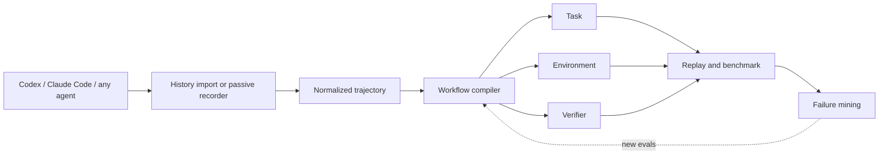

<div align="center">

# ScaleVerifier

### Turn real coding-agent usage into executable evaluations.

[](https://github.com/jinzijian/scaleverifier/actions/workflows/ci.yml)
[](https://www.python.org/)
[](LICENSE)

[简体中文](README.zh-CN.md)

**Keep your coding agent. ScaleVerifier turns what it already does into the tasks, environments, and verifiers needed to evaluate the next one.**

</div>

---

Your team is already generating the most relevant coding-agent benchmark it could have: real work.
The problem is that this work is trapped in agent histories, local repositories, shell output, and human
corrections. ScaleVerifier compiles those signals into portable eval bundles:

```text
(initial state, task, trajectory, final state, verifier)
```

It is not another coding agent, agent harness, or trace dashboard. It is the layer that turns production
usage into reusable evaluation infrastructure.

> [!WARNING]
> ScaleVerifier is an early alpha. The CLI and bundle schema may change. Generated verifiers are evidence,
> not proof of semantic correctness; inspect them before using scores for consequential decisions.

## The magic moment

```console
$ scaleverifier import codex --last 20
Imported codex-019f...
...
20 session(s) normalized locally.

$ scaleverifier compile latest
Benchmark ready.
Task:        codex-019f...
Environment: python (medium confidence)
Verifier:    2 command(s), source=trajectory
Bundle:      .scaleverifier/benchmarks/codex-019f...

$ scaleverifier benchmark latest \
    --candidate codex=/tmp/codex-result \
    --candidate claude=/tmp/claude-result
CANDIDATE              RESULT        SCORE    SECONDS
codex                  PASS          100.0%        8.3
claude                 FAIL           50.0%        7.9
```

The output above is illustrative. ScaleVerifier reports only results produced by the verifier commands in
your compiled bundle.

## Install

With [`uv`](https://docs.astral.sh/uv/):

```bash
uv tool install git+https://github.com/jinzijian/scaleverifier.git
```

Or for local development:

```bash
git clone https://github.com/jinzijian/scaleverifier.git
cd scaleverifier
uv sync
uv run scaleverifier doctor
```

ScaleVerifier has no runtime Python dependencies. Git is required; Docker is optional.

## Quick start

### 1. Import work you already did

ScaleVerifier currently understands local Codex and Claude Code JSONL histories:

```bash
# Auto-discover the most recent local sessions.
scaleverifier import codex --last 20
scaleverifier import claude --last 20

# Or import exact files.
scaleverifier import codex ~/.codex/sessions/2026/08/19/rollout-*.jsonl
scaleverifier import claude ~/.claude/projects/my-project/session.jsonl

scaleverifier sessions
```

Imports are local. ScaleVerifier writes normalized events, not a second copy of the raw history file.

### 2. Record a new run

Wrap any agent or command. Interactive commands use a PTY when available.

```bash
scaleverifier record \
  --task "Add cursor-based pagination without breaking existing clients" \
  --verify "python -m pytest -q" \
  -- claude
```

You can wrap Codex, Claude Code, Cursor's CLI, OpenHands, an internal agent, or a test script. A generic
command wrapper can observe process output and Git state; native history import provides richer tool-call
events.

### 3. Compile a session

```bash
scaleverifier compile latest

# Add an explicit behavioral verifier when inference is not enough.
scaleverifier compile SESSION_ID \
  --verify "python -m pytest tests/integration -q" \
  --verify "python -m ruff check src"
```

Verifier command precedence is:

1. commands explicitly supplied during `record` or `compile`;
2. test/build/lint commands recovered from the trajectory;
3. conservative repository conventions such as `pytest`, `npm test`, `cargo test`, or `go test`.

If no behavioral command can be recovered, ScaleVerifier says so and produces only a repository-change
check. It never silently presents that weak check as a strong verifier.

### 4. Replay the task

```bash
scaleverifier replay latest --dest /tmp/scaleverifier-task
cat .scaleverifier/benchmarks/*/task.md
```

Replay reconstructs a fresh Git workspace from the recorded base tree, initial patch, and allowed untracked
files. It does not apply the reference solution.

### 5. Evaluate agents or existing results

Run agents in independent fresh workspaces. The task is available through
`$SCALEVERIFIER_TASK`, `$SCALEVERIFIER_TASK_FILE`, and `$SCALEVERIFIER_WORKSPACE`:

```bash
scaleverifier benchmark latest \
  --agent 'codex=codex exec "$SCALEVERIFIER_TASK"' \
  --agent 'claude=claude -p "$SCALEVERIFIER_TASK"'
```

Or score existing checkouts:

```bash
scaleverifier benchmark latest \
  --candidate candidate-a=/path/to/checkout-a \
  --candidate candidate-b=/path/to/checkout-b
```

Mine obvious failure signals across local histories:

```bash
scaleverifier failures
```

Current failure mining is deliberately heuristic. It surfaces process failures, observed failing verification,
and human corrections after an agent claimed success; it does not pretend to infer a complete root cause.

## What gets compiled

Every bundle is self-contained enough to inspect, move, and restore without the original agent history:

```text
benchmark-id/
├── task.md                         # task presented to the candidate
├── task.json                       # complete machine-readable manifest
├── task.yaml                       # compact harness-friendly task record
├── verifier.py                     # dependency-free executable verifier
├── verifier.json                   # commands, timeout, and policy
├── setup.sh                        # standalone workspace restoration
├── Dockerfile                      # inferred environment starting point
├── environment/
│   ├── base.tar.gz                 # tracked tree at the base commit
│   ├── environment.json
│   └── untracked-initial.tar.gz
└── patches/
    ├── initial.patch               # dirty state that existed before the task
    └── reference.patch             # observed final state; never used by verifier
```

The reference patch supports error analysis and conservative verifier synthesis, such as identifying existing test
files the successful trajectory did not edit. Candidate evaluation never applies the patch and never compares for
exact patch equality.

## Architecture



The normalized trajectory schema and compiler trust boundaries are documented in
[`docs/schema.md`](docs/schema.md) and [`docs/design.md`](docs/design.md).

## Local-first privacy model

ScaleVerifier is useful without an account, server, telemetry endpoint, or data upload.

- Storage defaults to `.scaleverifier/` in the current Git repository, or `$SCALEVERIFIER_HOME`.
- Raw Codex and Claude Code histories are read in place and are not copied.
- Normalized message/tool text receives best-effort token and secret redaction.
- Common secret files such as `.env`, private keys, and Git-ignored files are excluded from untracked snapshots.
- No trajectory licensing, marketplace, or upload behavior exists in this repository.

Reproducibility and perfect sanitization are in tension. A compiled bundle intentionally contains a source-tree
snapshot and patches; tracked secrets or secrets embedded in source code may therefore remain. **Treat every
bundle as private until you inspect it.** See [`SECURITY.md`](SECURITY.md) before sharing a bundle.

## How this differs

| Category | Primary output | ScaleVerifier's relationship |
|---|---|---|
| Coding agents | A code change | Keep using them; ScaleVerifier observes or imports their work |
| Observability | Trace dashboards | ScaleVerifier compiles traces into executable assets |
| Agent harnesses | Agent loops and tool runtimes | ScaleVerifier supplies real tasks, environments, and verifiers |
| Static benchmarks | A fixed public task set | ScaleVerifier creates private, continuously refreshed tasks from real usage |
| RL frameworks | Optimization over a reward | ScaleVerifier can supply executable environments and verifier-based reward signals |

## Project status

Implemented today:

- local Codex and Claude Code history import;
- generic PTY/process recorder;
- normalized trajectory schema with best-effort redaction;
- Git base-state, dirty-patch, and untracked-file capture;
- portable replay bundles and generated Dockerfiles;
- explicit, trajectory-inferred, and repository-inferred verifiers;
- fresh-workspace agent benchmarking and existing-checkout scoring;
- lightweight failure-signal mining.

Next milestones:

- reproducibility scoring across many sessions;
- stronger verifier synthesis and verifier-miss detection;
- CI result and human correction adapters;
- deduplication, difficulty filtering, and benchmark registries;
- harness adapters for common eval and post-training frameworks;
- privacy review manifests and opt-in export workflows.

## Contributing

The highest-value contributions are new history adapters, reproducibility fixtures, verifier policies, and
adversarial examples that expose false passes. Read [`CONTRIBUTING.md`](CONTRIBUTING.md) before opening a PR.

## License

Apache License 2.0. See [`LICENSE`](LICENSE).
