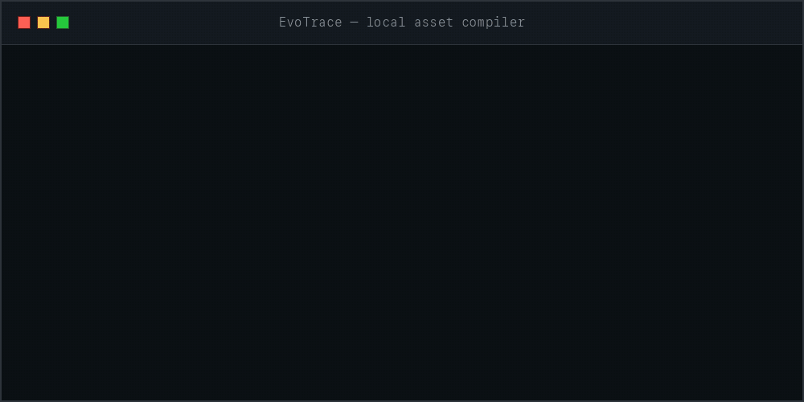
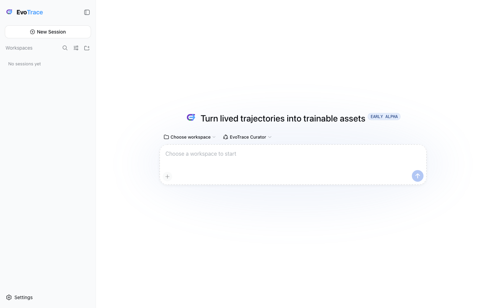

<div align="center">

# EvoTrace

### 把真实世界的 Claude Code / Codex 轨迹，变成可训练、可验证、可交易的 post-training 资产。

[快速开始](#快速开始) · [为什么需要它](#trajectory-还不是训练数据) · [三个-agent](#三个-agent三条权限边界) · [安全](#安全模型) · [English](README.md)

[](https://github.com/jinzijian/EvoTrace/actions/workflows/ci.yml)
[](https://github.com/deepseek-ai/deepseek-harness)
[](LICENSE)

## **可训练 · 可验证 · 可交易**

**面向真实 coding-agent experience 的 local-first 资产编译器。**

</div>

<p align="center">
  
</p>

## Trajectory 还不是训练数据

Claude Code 和 Codex 已经产生了大量有价值的真实轨迹：失败尝试、人工纠正、被删掉的实现、恢复路径、测试
和最终成功的修改。但 raw transcript 仍然缺少稳定的 task boundary、可恢复的 repository state、可重放环境、
经过验证的 verifier、隐私审核和 provenance。

EvoTrace 自动补齐中间这层编译过程：

```text
真实世界的 Claude Code / Codex sessions
                    ↓
         import + Git/repo archaeology
                    ↓
          基于证据的 trajectory mining
                    ↓
 preference data  ·  RL environments  ·  execution rewards
                    ↓
            本地训练 · 评测 · 授权合格资产
```

同一个 executable task 今天可以评测 agent，明天可以生成和打分新的 rollout，再把 verifier-grounded
trajectory 用作高质量 RL 数据。未来 opt-in 的 EvoTrace Marketplace 会让用户按自己的条款授权经过审核、
权利清晰的资产，而不是把 raw history 低价交给数据中间商。

EvoTrace 还补上第二个闭环：Explorer 在真实 repo 中自动提出并执行问题，Experience Compressor 把执行轨迹
压成可复用经验，再让全新的 solver 在 held-out task 上做 baseline / conditioned 对照。压缩质量由下游任务
是否真的更容易解出来衡量，而不是让另一个 LLM 主观评价 summary 写得好不好。

```text
真实 repo → execution exploration → trajectory capsule → experience packet
                                                      ↓
                     held-out task：baseline vs conditioned solver
                                                      ↓
                          Docker reward → 自适应 curriculum
```

> [!IMPORTANT]
> Marketplace 和 managed fine-tuning integration 仍是 roadmap。当前开源版本在本地工作；任何数据默认都
> 不会上传、出售或分享。

## 完全基于 DeepSeek Harness

EvoTrace 现在是 [DeepSeek Harness](https://github.com/deepseek-ai/deepseek-harness) 的专用 distribution，
不再维护另一套临时 chat/CLI 界面。

DeepSeek Harness 负责 Web/agent shell、session、streaming、slash command、模型设置、credential、approval
和 plugin runtime。EvoTrace 负责领域层：

- Claude Code / Codex 历史 import；
- trajectory mining 与 evidence catalog；
- 一个 Orchestrator，按顺序打开四个最小权限 DeepSeek subagent；
- 由现有 Python core 驱动的固定、allowlisted compiler tools；
- EvoTrace 品牌与 onboarding；
- autonomous execution 必须进入 Docker 的安全契约。

原来的 Python package 变成内部 deterministic compiler sidecar，不再负责产品界面、模型路由或 agent loop。

<p align="center">
  
</p>

## 快速开始

### macOS、Linux、WSL 一键安装

```bash
curl -LsSf https://raw.githubusercontent.com/jinzijian/EvoTrace/main/install.sh | sh
```

安装完成后：

```bash
evotrace
```

新 session 默认使用 Harness 的 **Full access** 权限 preset。如需改为较窄的 workspace sandbox，可运行
`DSH_PERMISSION_MODE=workspace-write evotrace`。

### Windows PowerShell 一键安装

```powershell
irm https://raw.githubusercontent.com/jinzijian/EvoTrace/main/install.ps1 | iex
evotrace
```

### 从源码运行

需要 Git、Node.js `22.19+` 或 `24+`、Python `3.9+`；进行隔离执行时还需要 Docker。

```bash
git clone https://github.com/jinzijian/EvoTrace.git
cd EvoTrace
python3 -m venv .venv
.venv/bin/python -m pip install -e .
pnpm install
pnpm dev
```

第一次启动：

1. 选择一个 workspace；
2. 按需在 Settings 中配置 DeepSeek、OpenAI 或 Anthropic；
3. 输入 `/` 打开 command palette；
4. 运行 `/init`，索引已有的 Claude Code / Codex history。

产品里的主要命令：

```text
/init [all|codex|claude]    导入已有历史并刷新 mining
/candidates                浏览按证据排序的 candidates
/search payment retry      搜索 task、repo 和 evidence
/show 1                    检查 provenance 与 readiness gap
/review 1                  运行四个 agent 的 sequential review pipeline
/build 1                   编译 Docker-ready asset candidate
/validate 1                在 Docker 中验证 base 失败、reference 通过
/calibrate 1               让 DeepSeek 独立求解 5 次，目标通过 2 次
/harden 1                  派生、验证并 self-play 一个更难的 child task
/evolve 1 2                探索资产 1，在同 repo 的 held-out 资产 2 上测试压缩经验
/assets                    查看已编译资产
/runs                      查看保存的 validation evidence
/doctor                    检查本地 integration
```

这些是 Harness 原生 slash command，同时也是 typed agent tools。API Key 只在 Harness Settings 中填写；
EvoTrace 不接受把 key 写进 slash command，也不会把它记录进 trajectory。

## 一个 Orchestrator，四个顺序 Subagent

`/review <candidate>` 会启动一个 model turn。EvoTrace Orchestrator 必须等前一个 foreground DeepSeek
Harness child 返回之后，才能启动下一阶段；因此下游拿到的是完整上游证据，而不是四个互不相关的投票。Candidate Gate
必须先写入一个不可变 route：`direct`、`derived_seed`、`preference_only` 或 `reject`。这个决策与确切
candidate ID 绑定；build/harden 不能中途换题，validation 也只能作用于 Hardener 真正产出的资产。

| 阶段 | 可以做 | 不可以做 |
|---|---|---|
| **Episode Miner** | 切分 coherent episode、统计有效动作 | 用 raw length 充当质量证明、build 或批准 asset |
| **Candidate Gate** | 判断 value、complexity 与 reconstructability | 修改数据、把所有维度压成一个分数 |
| **Task Builder / Hardener** | 编译 direct bundle，或通过固定工具派生更难 child | 修改源 checkout、批准自己的 verifier |
| **Verifier Critic** | 执行固定 Docker validation 与 opt-in self-play；审核 provenance/run | 在宿主执行 verifier、缺证据时认证 |

产品 roster 只暴露 EvoTrace Orchestrator。每个角色都是全新的 foreground one-shot child session，有各自
的 tool allowlist，且没有继续 delegation 的权限。通用 DSH coding preset 被有意排除，因为它们的宿主访问
契约与 EvoTrace 不同。

## 产出的资产是什么

| 资产层 | 证据或产物 | 用途 |
|---|---|---|
| Preference / correction | 人工修改、rejected/chosen、成功 recovery | DPO、SFT、QA、preference learning |
| Executable task | task intent、repository base、initial state、environment evidence | agent eval、regression、RL environment |
| Verifier / reward candidate | test command、check、provenance、sandbox policy | 验证后用于 rollout scoring 与 execution reward |
| Validated trajectory | replayed rollout 加独立 verifier evidence | 高质量 SFT / RL post-training data |
| Execution experience | runtime fact、command、code location、failure 与 compression provenance | 通过 held-out 验证后用于 conditioning、curriculum 与训练样本 |

`Mined`、`Buildable`、`bundle generated` 和 `Verified` 是不同状态。历史 session 只有在同时具备有意义的
task、execution-verifiable route、repository base、至少 medium 的重建置信度、reference patch、可执行的
verification command 和支持的环境时，才能构建。空 attachment wrapper、low-confidence 重建、缺失 Node
manifest 都会 fail closed，不再生成弱 bundle。LLM 写出 verifier 不代表已经 `Verified`。

Codex subagent / fork 轨迹仍会连同 parent lineage 保留，用于审计和后续 preference mining；但默认候选列表会隐藏
它们，避免把一个 parent session 误算成多道独立任务。需要时可用 `/candidates --all` 显式查看。

<p align="center">
  
</p>

## 安全模型

- Importer 读取 Claude Code / Codex history 和 Git evidence，但不修改源文件；
- Orchestrator 与叶子 subagent 只暴露固定领域操作，不提供任意宿主 shell 或 filesystem tool；
- launcher 默认关闭 DSH telemetry，除非用户显式覆盖；
- 产品数据位于 `~/.evotrace/`，Harness 状态隔离在 `~/.evotrace/harness/`；
- Verifier validation 在全新 Docker world 中完成：禁止源仓库 bind
  mount、Docker socket、host network、privileged、宿主 credential 和任意 output path；
- Builder 与 Verifier Critic 是不同 child session；Builder 不能批准自己的 verifier。
- `/review` 强制顺序执行：Episode Miner → Candidate Gate → Task Builder/Hardener → Verifier Critic。
- `/calibrate` 需要显式同意，因为 task context 会发送给已配置的 DeepSeek provider。每次 attempt 都从全新的 task-only workspace 开始，不包含 reference；最终评分在无 host mount 的 Docker 中完成。
- `/evolve` 同样需要显式同意。Explorer 只在一次性 workspace sandbox 内工作；保存的 capsule 排除 hidden reasoning，并做 secret/absolute-path redaction；下游 solver 看不到 raw capsule，patch 最终在 Docker 中评分。
- Explorer、Compressor 和每个 paired solver attempt 都必须通过 workspace-boundary access audit，结果才可能被认证。

规范见 [sandbox contract](docs/sandbox-contract.md) 与 [design](docs/design.md)。

> [!WARNING]
> EvoTrace 仍是 early alpha，DeepSeek Harness 也处在 developer preview。Mining label 和生成的 verifier
> candidate 是 evidence，不是证明。训练或分享前必须人工检查。

## 当前进度

V0.8 已包含：

- 真正的 DeepSeek Harness Web app，以及 EvoTrace 标题、mark、onboarding 和 provider settings；
- 一个 managed EvoTrace Orchestrator，以及四个 foreground、最小权限 subagent role；
- 原生 `/init`、`/import`、`/mine`、`/candidates`、`/search`、`/show`、`/review`、`/build`、`/harden`、`/validate`、`/calibrate`、`/evolve`、`/assets`、`/runs`、`/doctor`；
- Claude Code / Codex import、edit-event reference reconstruction、deterministic mining、bundle generation、provenance 与 privacy gate；
- fail-closed 构建准入、基于 command 的 Python / Node 环境推断，以及默认去重顶层 session 与 Codex nested subagent；
- 不可变的 `/review` route token 和 produced-asset lineage，阻止下游阶段换 candidate 执行；
- Docker-only 双状态 verifier validation：behavioral verifier 必须拒绝 base、接受 reference；
- 与精确 bundle digest 绑定的 immutable run evidence；只有合规 Docker run 才会把资产提升为 `Verified`。
- DeepSeek self-play 难度校准：5 次独立求解、目标通过数、自动增加或删除 hint、只在 reference 通过后采用的 verifier overlay，以及无法诚实调到目标区间时明确标记 `too_easy` / `too_hard`。
- execution-experience evolution：自动 runtime exploration、grounded trajectory compression、baseline / conditioned paired held-out solving、Docker reward、utility 估计与 curriculum feedback。

`/evolve <source> <held-out>` 只有在两个资产来自同一 repo、且 held-out task 独立构建时，才可能得到可认证的
functional-compression 结果。不提供第二个资产时会明确标成 `smoke_only`：它只能证明链路跑通，不能把同题
信息泄漏误报为 transferable experience。

仍在继续：

- 更广泛的跨语言 dependency repair 与 autonomous environment-builder loop；
- 自动生成独立 held-out task，以及对移除全部合法 hint 后仍然过于简单的资产进行 adversarial semantic mutation；
- 经过验证的 DPO / SFT / RL dataset exporter；
- opt-in Marketplace 与 fine-tuning service integration。

## 致谢

- [DeepSeek Harness](https://github.com/deepseek-ai/deepseek-harness) 是 application 与 agent foundation；
- [Microsoft RepoLaunch](https://github.com/microsoft/RepoLaunch) 是 repository-to-environment reconstruction 的
  主要技术启发。EvoTrace 从更早一层开始：从真实 coding-agent 工作里挖掘 task 与 learning signal。

## License

Apache-2.0，见 [LICENSE](LICENSE) 与 [NOTICE](NOTICE)。
