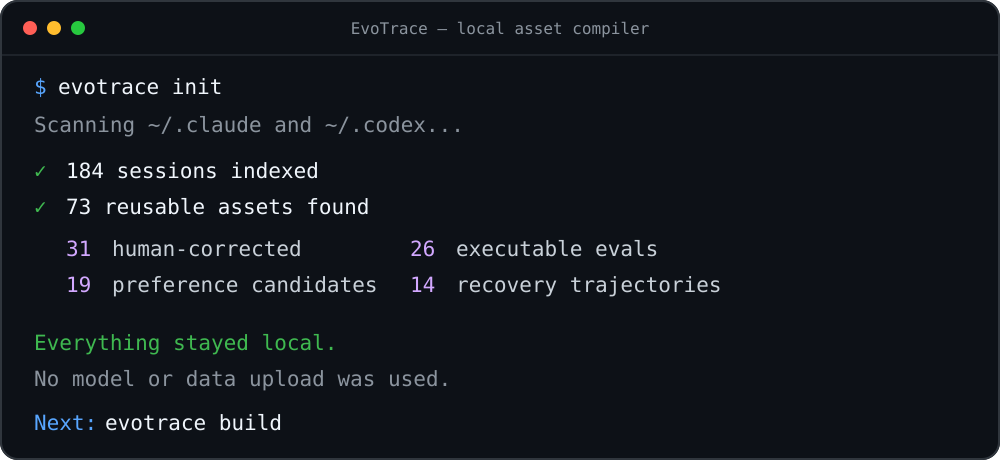
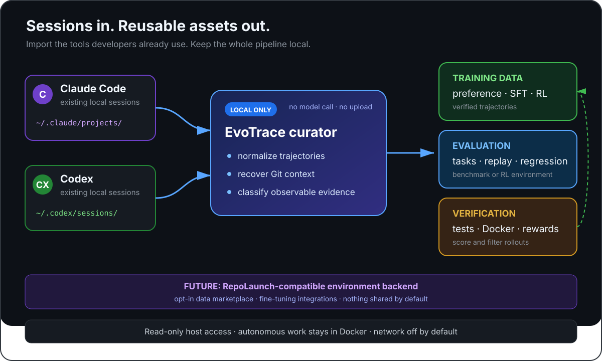
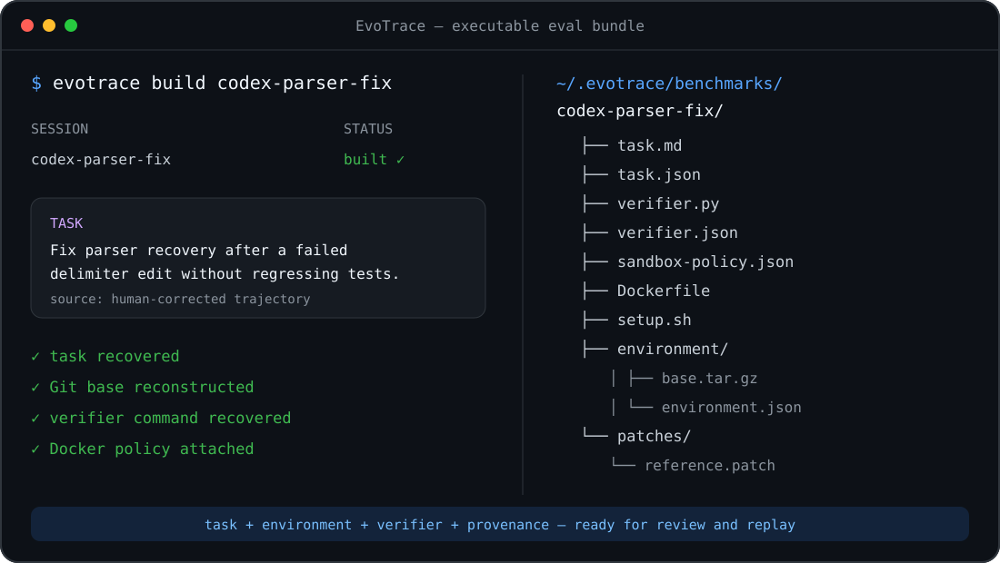

<div align="center">

# EvoTrace

### 把每一条 Claude Code 和 Codex session，变成可复用的训练、评测与验证资产。

[快速开始](#-快速开始) · [你会得到什么](#你会得到什么) · [工作原理](#工作原理) · [安全模型](#安全模型) · [English](README.md)

[](https://github.com/jinzijian/evotrace/actions/workflows/ci.yml)
[](https://www.python.org/)
[](LICENSE)

**Agent session 不是用完即弃的聊天记录，而是会持续复利的数据资产。**

</div>

<p align="center">
  
</p>

<p align="center"><sub>图中数字是示例；真实运行只会展示你本地历史产生的统计。</sub></p>

## ⚡ 快速开始

### macOS、Linux 或 WSL

```bash
curl -LsSf https://raw.githubusercontent.com/jinzijian/evotrace/main/install.sh | sh
```

### Windows PowerShell

```powershell
irm https://raw.githubusercontent.com/jinzijian/evotrace/main/install.ps1 | iex
```

安装后只需运行：

```bash
evotrace init
```

EvoTrace 会自动发现已有的 Claude Code 和 Codex session，在本地建立索引并挖掘有价值的候选资产。
安装脚本只负责安装 CLI，不会读取 session 数据。运行前可以先查看 [Unix 安装脚本](install.sh) 或
[PowerShell 安装脚本](install.ps1)。

已经在使用 [`uv`](https://docs.astral.sh/uv/)：

```bash
uv tool install git+https://github.com/jinzijian/evotrace.git
evotrace init
```

前置条件是 Git，以及 `uv`、`pipx` 或 Python 3.9+ 中的任意一个。只有执行 sandbox workload 时才需要
Docker。`et` 是短命令；旧 CLI 名称继续作为兼容别名保留。

## 你会得到什么

| 资产 | 从 session 中恢复 | 可以用于 |
|---|---|---|
| 训练 | 人工纠正、preference pair、成功恢复轨迹 | DPO、SFT、QA、数据筛选 |
| 评测 | 任务意图、repository base、环境证据 | 可重放的 coding-agent eval |
| 验证 | 测试命令、执行结果、行为检查 | Docker verifier 与 execution reward |

EvoTrace 直接配合开发者已经在使用的 agent，不需要代理层、托管 agent 或新的编辑器。V0.3 curator 是
确定且可审计的 heuristic：不会调用 LLM，也不会上传 session 数据。

> [!WARNING]
> EvoTrace 目前是 early alpha。分类标签和自动生成的 verifier 都是证据，不是任务质量或语义正确性的
> 证明。用于重要评测或分享之前必须人工检查。

## 工作原理

<p align="center">
  
</p>

<p align="center"><sub>宿主侧 pipeline 坚持 local-first；autonomous agent 只能在临时 Docker workspace 内工作。</sub></p>

## 核心流程

### `evotrace init`：一条命令完成导入和挖掘

```bash
evotrace init
evotrace init --source codex --last 50
```

第一天直接使用 `init`。它把自动发现、增量导入和本地 mining 合并成一个 onboarding 命令；需要精细
控制时，再使用下面的分阶段命令。

### `evotrace import`：导入已经存在的历史

```bash
# 自动发现两个来源，导入当前可见的全部 session
evotrace import

# 只导入某一个来源，或限制最近文件数
evotrace import codex
evotrace import claude --last 20

# 也可以给出精确文件
evotrace import codex ~/.codex/sessions/2026/08/19/rollout-*.jsonl
evotrace import codex ~/.codex/history.jsonl
evotrace import claude ~/.claude/projects/my-project/session.jsonl
```

Importer 遵循 `$CODEX_HOME` 和 `$CLAUDE_CONFIG_DIR`。对于 Codex，它会区分包含完整事件的 session JSONL
与较轻的 prompt history；同一个 session 两者都存在时保留信息更丰富的一份。Claude Code 文档说明
session transcript 以明文保存在 `~/.claude/projects/`，默认清理窗口是 30 天，因此安装后尽快做一次索引
很重要。参考 [Claude Code session 文档](https://code.claude.com/docs/en/sessions)、
[Claude Code 数据目录文档](https://code.claude.com/docs/en/claude-directory)、
[Codex 配置文档](https://developers.openai.com/codex/config-reference) 和
[Codex CLI resume 文档](https://developers.openai.com/codex/cli/reference)。

Import 默认是增量的：用文件大小和修改时间跳过没有变化的源文件。`--refresh` 可以强制重建索引。原始
history 只在原位置读取，不会被复制进 EvoTrace store。

### `evotrace mine`：找到值得保留的 experience

```bash
evotrace mine
evotrace mine --source codex --min-score 4
evotrace mine --json
```

V0.3 只依赖能观测到的证据：是否恢复出非平凡任务、是否调用代码编辑工具、是否运行 test/lint/build、失败
之后是否成功、agent 工作后是否出现人工纠正，以及仓库 base 的恢复置信度。每个 candidate 的 score、label、
signal 和 evidence 都保存在 `~/.evotrace/candidates/`。

- `preference_candidate`：可能形成 rejected/chosen、纠错 pair、DPO、QA 或 SFT 数据；
- `execution_verifiable`：有代码编辑、验证命令和可恢复的 repository base；
- `recovery_trajectory`：失败或人工纠正之后继续修复并出现恢复工作。

第一版故意不使用 model judge。以后可以把 curator agent 接到相同 schema 后面，但不能抹掉 provenance。

### `evotrace build`：编译可执行 eval 资产

```bash
# 编译得分最高的 execution-verifiable candidates
evotrace build --limit 10

# 编译一个 session，并显式补充可信 verifier
evotrace build SESSION_ID \
  --verify "python -m pytest tests/integration -q" \
  --verify "python -m ruff check src"
```

Transcript 本身不等于完整 environment。Builder 会把 session evidence 与本地 Git archaeology 合并：优先
使用 session 记录的 commit，否则尝试按时间查找 commit，并明确记录 reconstruction confidence，而不是假装
恢复结果完全准确。产物包括：

<p align="center">
  
</p>

<p align="center"><sub>Build 输出示例；每个恢复出的 task 与 verifier 都保留可检查的 provenance。</sub></p>

```text
benchmark-id/
├── task.md
├── task.json
├── task.yaml
├── verifier.py
├── verifier.json
├── sandbox-policy.json
├── setup.sh
├── Dockerfile
├── environment/
│   ├── base.tar.gz
│   ├── environment.json
│   └── untracked-initial.tar.gz
└── patches/
    ├── initial.patch
    └── reference.patch
```

Verifier 的来源始终可见：用户显式提供、trajectory 中恢复、repository convention 推断，或者明确警告当前
没有 behavioral verifier。

## 第二天以后：持续增量 capture

```bash
evotrace watch                 # 每五分钟检查一次，并重新 mine
evotrace watch --interval 60
evotrace watch --once          # 适合 cron / nightly job
```

Watcher 只读取发生变化的 history 文件，不修改 Claude Code、Codex 或任何源代码仓库。

## 安全模型

### Agent 只能在容器里工作

宿主侧 importer/builder 可以读取 session 文件和 Git object，但绝不能把可写的宿主 checkout 交给 autonomous
agent。每个 bundle 都包含 `sandbox-policy.json` 和非 root Dockerfile。硬边界是：

- 源代码以 archive 复制进 image，而不是可写 bind mount；
- 不挂 Docker socket，不使用 privileged/host PID，不传宿主 credentials；
- runtime 默认断网、drop Linux capabilities、禁止 new privileges；
- agent 可以随意修改或删除容器里的 `/workspace` 副本；
- 只有验证后的结果才能被提升到一个全新、唯一的 host run directory；
- 内部系统只能通过显式只读 adapter 或 deterministic mock 暴露，绝不提供 production write credential。

因此 V0.3 已经拒绝旧的 `benchmark --agent` 宿主执行方式。安全的 container orchestrator 是下一个 runtime
milestone；当前 `evotrace build` 会生成其完整且可检查的输入。已有 candidate checkout 仍可由用户显式执行
`evotrace benchmark ... --candidate NAME=PATH` 评分。

完整约束见 [sandbox contract](docs/sandbox-contract.md) 和 [SECURITY.md](SECURITY.md)。

### 存储与隐私

默认 store 是 `~/.evotrace/`，也可以用 `$EVOTRACE_HOME` 或 `--home` 修改。如果已经存在旧的
`~/.scaleverifier/`，并且新路径还没有创建，EvoTrace 会自动继续使用旧 store。

- 不需要账号、hosted LLM、API key、遥测、付费流程或数据上传；
- 统一后的文本会进行 best-effort secret redaction；
- untracked snapshot 排除 Git-ignored、常见 `.env` 和私钥后缀；
- 编译 bundle 包含源码，仍可能带有 Git 已跟踪的 secret，检查之前必须把它当作私有资产。

## V0.3 已实现

- 一条命令完成 onboarding 的 `evotrace init`，以及 macOS/Linux/WSL/Windows 安装脚本；
- Claude Code / Codex 全量与增量历史发现；
- rich session 与 prompt history 的去重优先级；
- 本地统一、脱敏 trajectory；
- preference、execution、correction、recovery、low-value 的可审计 mining；
- Git 时间对齐与 reconstruction confidence；
- task、environment、Dockerfile、verifier bundle；
- container-only policy、非 root image、禁止 host-agent fallback；
- V0.1 的 replay、verifier 与已有 candidate 评分。

下一步：

- 只在 sandbox 中运行的 curator/builder agent，自动生成 mock 并补全 verifier；
- verifier validation 与 reward-hacking 检查；
- opt-in 只读 internal adapter 和 record/replay mock；
- DPO、preference、QA、SFT、executable eval 导出；
- 去重、难度估计和 benchmark registry。

数据结构见 [docs/design.md](docs/design.md) 和 [docs/schema.md](docs/schema.md)。

## 社区与开发

问题讨论、聚合结果分享和新 history adapter 提案请使用
[GitHub Discussions](https://github.com/jinzijian/evotrace/discussions)；可复现的问题请提交到
[GitHub Issues](https://github.com/jinzijian/evotrace/issues)。不要公开原始 trajectory 或未经检查的 bundle。

```bash
git clone https://github.com/jinzijian/evotrace.git
cd evotrace
uv sync
uv run python -m unittest discover -s tests -v
uvx ruff check src tests
```

Adapter 约束和 pull-request checklist 见 [CONTRIBUTING.md](CONTRIBUTING.md)。

## License

Apache License 2.0。
